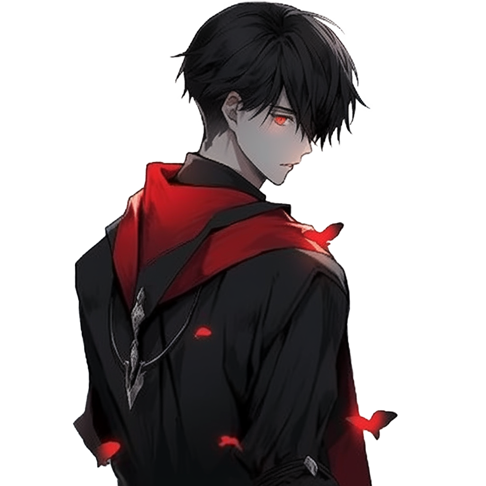

<h1 align="center">💠 ようこそ 👋, 𝘐'𝘮 Dara! 💠</h1>

  

 

  
  

    
&#10022; Call me Dara, or something cooler you might come up with.

    
&#10022; Age is just a number, but for the curious, I'm 21 orbits around the sun.

    
&#10022; <strong>Blockchain Developer</strong> | Engineering smart contracts that power Dapps.

    
&#10022; <strong>Smart Contract Auditor</strong> | Ensuring smart contracts are secure.

    
&#10022; <strong>Game Developer</strong> | Creating immersive worlds where stories unfold.

    
&#10022; <strong>My quest</strong>? To connect with minds alike. guide me to bring the games in my head to life.

    
&#10022; Let's talk about the future of blockchain, the thrill of games, and the worlds within animes.

  

 

<h2 align="center">💻 Skills 💻</h2>

  <!-- You can list your skills here, consider using a table or list format -->
  <ul>
    <li>Blockchain Development</li>
    <li>Smart Contract Auditing</li>
    <li>Game Development</li>
    <!-- Add more skills as needed -->
  </ul>

